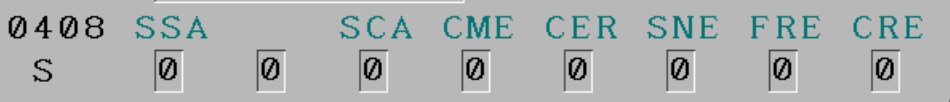

# CNC_GETPATH

Reads the current selected path number which is the target path of the Data window functions.

```json
{
  "method": "cnc_getpath",
  "invocationMs": 0,
  "doc": "https://www.inventcom.net/fanuc-focas-library/misc/cnc_getpath",
  "success": true,
  "rc": 0,
  "request": {
    "cnc_getpath": {
      "path_no": 0
    }
  },
  "response": {
    "cnc_getpath": {
      "path_no": 1,
      "maxpath_no": 1
    }
  }
}
```

# CNC_SYSINFO

Reads system information such as kind of CNC system, Machining(M) or Turning(T), series and version of CNC system software and number of the controlled axes.

```json
{
  "method": "cnc_sysinfo",
  "invocationMs": 0,
  "doc": "https://www.inventcom.net/fanuc-focas-library/misc/cnc_sysinfo",
  "success": true,
  "rc": 0,
  "request": {
    "cnc_sysinfo": {}
  },
  "response": {
    "cnc_sysinfo": {
      "sysinfo": {
        "addinfo": 1090,
        "max_axis": 32,
        "cnc_type": [
          " ",
          "0"
        ],
        "mt_type": [
          " ",
          "M"
        ],
        "series": [
          "D",
          "4",
          "F",
          "1"
        ],
        "version": [
          "3",
          "0",
          ".",
          "0"
        ],
        "axes": [
          "0",
          "3"
        ]
      }
    }
  }
}
```
* handler: Native

`fanuc/{id}/sys_info/1`
```json
{
  "addinfo": 1090,
  "max_axis": 32,
  "cnc_type": " 0",
  "mt_type": " M",
  "series": "D4F1",
  "version": "30.0",
  "axes": "03"
}
```

# CNC_STATINFO

Reads the status information of CNC.

```json
{
  "method": "cnc_statinfo",
  "invocationMs": 6,
  "doc": "https://www.inventcom.net/fanuc-focas-library/misc/cnc_statinfo",
  "success": true,
  "rc": 0,
  "request": {
    "cnc_statinfo": {}
  },
  "response": {
    "cnc_statinfo": {
      "statinfo": {
        "dummy": 0,
        "tmmode": 0,
        "aut": 1,
        "run": 3,
        "motion": 1,
        "mstb": 0,
        "emergency": 0,
        "alarm": 0,
        "edit": 0
      }
    }
  }
}
```

# CNC_RDBLKCOUNT

Reads the value of block counter.

```json
{
  "method": "cnc_rdblkcount",
  "invocationMs": 8,
  "doc": "https://www.inventcom.net/fanuc-focas-library/program/cnc_rdblkcount",
  "success": true,
  "rc": 0,
  "request": {
    "cnc_rdblkcount": {}
  },
  "response": {
    "cnc_rdblkcount": {
      "prog_bc": 108
    }
  }
}
```

# CNC_RDACTPT

Get the actual execution pointer in MDI, MEM and EDIT, TJOG, THND mode.

```json
{
  "method": "cnc_rdactpt",
  "invocationMs": 6,
  "doc": "https://www.inventcom.net/fanuc-focas-library/program/cnc_rdactpt",
  "success": true,
  "rc": 0,
  "request": {
    "cnc_rdactpt": {}
  },
  "response": {
    "cnc_rdactpt": {
      "prog_no": 1,
      "blk_no": 107
    }
  }
}
```

# CNC_RDEXECPROG

Reads the contents of NC program being executed on CNC.

```json
{
  "method": "cnc_rdexecprog",
  "invocationMs": 4,
  "doc": "https://www.inventcom.net/fanuc-focas-library/program/cnc_rdexecprog",
  "success": true,
  "rc": 0,
  "request": {
    "cnc_rdexecprog": {
      "length": 128
    }
  },
  "response": {
    "cnc_rdexecprog": {
      "length": 127,
      "blknum": 1,
      "data": [
        "X",
        "8",
        "9",
        ".",
        "7",
        "8",
        "9",
        "n",
        ...
        "u0000"
      ]
    }
  }
}
```

# CNC_GETFIGURE

Reads the maximum valid figures and the number of decimal places under the input/output unit, which is related to various data of CNC.

```json
{
  "method": "cnc_getfigure",
  "invocationMs": 3,
  "doc": "https://www.inventcom.net/fanuc-focas-library/misc/cnc_getfigure",
  "success": true,
  "rc": 0,
  "request": {
    "cnc_getfigure": {
      "data_type": 0,
      "axis": 32
    }
  },
  "response": {
    "cnc_getfigure": {
      "valid_fig": 9,
      "dec_fig_in": [
        3,
        3,
        3,
        0,
        0,
        0,
        0,
        0,
        0,
        ...
      ],
      "dec_fig_out": [
        3,
        3,
        3,
        0,
        0,
        0,
        0,
        0,
        0,
        ...
      ]
    }
  }
}
```

# CNC_RDAXISNAME

Reads the axis names from 1st axis to the specified axis number.

```json
{
  "method": "cnc_rdaxisname",
  "invocationMs": 4,
  "doc": "https://www.inventcom.net/fanuc-focas-library/position/cnc_rdaxisname",
  "success": true,
  "rc": 0,
  "request": {
    "cnc_rdaxisname": {
      "data_num": 8
    }
  },
  "response": {
    "cnc_rdaxisname": {
      "data_num": 3,
      "axisname": {
        "data1": {
          "name": 88,
          "suff": 0
        },
        "data2": {
          "name": 89,
          "suff": 0
        },
        "data3": {
          "name": 90,
          "suff": 0
        },
        "data4": {
          "name": 0,
          "suff": 0
        },
        "data5": {
          "name": 0,
          "suff": 0
        },
        "data6": {
          "name": 0,
          "suff": 0
        },
        "data7": {
          "name": 0,
          "suff": 0
        },
        "data8": {
          "name": 0,
          "suff": 0
        }
      }
    }
  }
}
```

# CNC_RDDYNAMIC2

Reads various data which changes at CNC operation at a time.

```json
{
  "method": "cnc_rddynamic2",
  "invocationMs": 4,
  "doc": "https://www.inventcom.net/fanuc-focas-library/position/cnc_rddynamic2",
  "success": true,
  "rc": 0,
  "request": {
    "cnc_rddynamic2": {
      "axis": 2,
      "length": 44
    }
  },
  "response": {
    "cnc_rddynamic2": {
      "rddynamic": {
        "dummy": 0,
        "axis": 2,
        "alarm": 0,
        "prgnum": 1,
        "prgmnum": 1,
        "seqnum": 0,
        "actf": 40,
        "acts": 174,
        "pos": {
          "absolute": 47940,
          "machine": 47940,
          "relative": 47940,
          "distance": 0
        }
      }
    }
  }
}
```

# CNC_RDSPDLNAME

Reads the spindle names from 1st spindle to the specified spindle number.

```json
{
  "method": "cnc_rdspdlname",
  "invocationMs": 18,
  "doc": "https://www.inventcom.net/fanuc-focas-library/position/cnc_rdspdlname",
  "success": true,
  "rc": 0,
  "request": {
    "cnc_rdspdlname": {
      "data_num": 4
    }
  },
  "response": {
    "cnc_rdspdlname": {
      "data_num": 1,
      "spdlname": {
        "data1": {
          "name": 83,
          "suff1": 32,
          "suff2": 0,
          "suff3": 32
        },
        "data2": {
          "name": 0,
          "suff1": 0,
          "suff2": 0,
          "suff3": 0
        },
        "data3": {
          "name": 0,
          "suff1": 0,
          "suff2": 0,
          "suff3": 0
        },
        "data4": {
          "name": 0,
          "suff1": 0,
          "suff2": 0,
          "suff3": 0
        }
      }
    }
  }
}
```

# CNC_RDSPEED

Reads the actual feed rate and the actual rotational speed of the spindle.

```json
{
  "method": "cnc_rdspeed",
  "invocationMs": 4,
  "doc": "https://www.inventcom.net/fanuc-focas-library/position/cnc_rdspeed",
  "success": true,
  "rc": 0,
  "request": {
    "cnc_rdspeed": {
      "type": -1
    }
  },
  "response": {
    "cnc_rdspeed": {
      "speed": {
        "actf": {
          "data": 40,
          "dec": 0,
          "unit": 0,
          "disp": 0,
          "name": 70,
          "suff": 0
        },
        "acts": {
          "data": 174,
          "dec": 0,
          "unit": 2,
          "disp": 1,
          "name": 83,
          "suff": 32
        }
      }
    }
  }
}
```

# CNC_ACTS2

Reads the actual rotational speed of the spindle connected to CNC.

```json
{
  "method": "cnc_acts2",
  "invocationMs": 3,
  "doc": "https://www.inventcom.net/fanuc-focas-library/position/cnc_acts2",
  "success": true,
  "rc": 0,
  "request": {
    "cnc_acts2": {
      "sp_no": 1
    }
  },
  "response": {
    "cnc_acts2": {
      "actualspindle": {
        "datano": 1,
        "type": 0,
        "data": [
          174,
          0,
          0,
          0
        ]
      }
    }
  }
}
```

# CNC_RDSPMETER

Reads the spindle load meter data and the spindle motor speed data from 1st spindle to the specified spindle number.

```json
{
  "method": "cnc_rdspmeter",
  "invocationMs": 7,
  "doc": "https://www.inventcom.net/fanuc-focas-library/position/cnc_rdspmeter",
  "success": true,
  "rc": 0,
  "request": {
    "cnc_rdspmeter": {
      "type": -1,
      "data_num": 1
    }
  },
  "response": {
    "cnc_rdspmeter": {
      "data_num": 1,
      "loadmeter": {
        "spload1": {
          "spload": {
            "data": 1,
            "dec": 0,
            "unit": 0,
            "name": 83,
            "suff1": 32,
            "suff2": 0,
            "reserve": 0
          },
          "spspeed": {
            "data": 174,
            "dec": 0,
            "unit": 1,
            "name": 83,
            "suff1": 32,
            "suff2": 0,
            "reserve": 0
          }
        },
        "spload2": {
          "spload": {
            "data": 0,
            "dec": 0,
            "unit": 0,
            "name": 0,
            "suff1": 0,
            "suff2": 0,
            "reserve": 0
          },
          "spspeed": {
            "data": 0,
            "dec": 0,
            "unit": 0,
            "name": 0,
            "suff1": 0,
            "suff2": 0,
            "reserve": 0
          }
        },
        "spload3": {
          "spload": {
            "data": 0,
            "dec": 0,
            "unit": 0,
            "name": 0,
            "suff1": 0,
            "suff2": 0,
            "reserve": 0
          },
          "spspeed": {
            "data": 0,
            "dec": 0,
            "unit": 0,
            "name": 0,
            "suff1": 0,
            "suff2": 0,
            "reserve": 0
          }
        },
        "spload4": {
          "spload": {
            "data": 0,
            "dec": 0,
            "unit": 0,
            "name": 0,
            "suff1": 0,
            "suff2": 0,
            "reserve": 0
          },
          "spspeed": {
            "data": 0,
            "dec": 0,
            "unit": 0,
            "name": 0,
            "suff1": 0,
            "suff2": 0,
            "reserve": 0
          }
        }
      }
    }
  }
}
```

# CNC_RDSPMAXRPM

Reads the maximum r.p.m. ratio of serial spindle.

```json
{
  "method": "cnc_rdspmaxrpm",
  "invocationMs": 4,
  "doc": "https://www.inventcom.net/fanuc-focas-library/position/cnc_rdspmaxrpm",
  "success": true,
  "rc": 0,
  "request": {
    "cnc_rdspmaxrpm": {
      "sp_no": 1
    }
  },
  "response": {
    "cnc_rdspmaxrpm": {
      "serialspindle": {
        "datano": 1,
        "type": 0,
        "data": [
          190,
          0,
          0,
          0
        ]
      }
    }
  }
}
```

# CNC_RDSPGEAR

Reads the gear ratio of the serial spindle.

```json
{
  "method": "cnc_rdspgear",
  "invocationMs": 5,
  "doc": "https://www.inventcom.net/fanuc-focas-library/position/cnc_rdspgear",
  "success": true,
  "rc": 0,
  "request": {
    "cnc_rdspgear": {
      "sp_no": 1
    }
  },
  "response": {
    "cnc_rdspgear": {
      "serialspindle": {
        "datano": 1,
        "type": 0,
        "data": [
          672,
          0,
          0,
          0
        ]
      }
    }
  }
}
```

# CNC_DIAGNOSS

Reads the diagnosis specified by "number","axis" (only for the diagnosis with axis).

[Fanuc 30i Diagnosis Parameters](docs/Fanuc_30i_diagnosis_parameters.pdf)

## 400

Communication with the spindle control side has been established.

- type: byte
- bit: 7, LNK


```json
{
  "method": "cnc_diagnoss",
  "invocationMs": 34,
  "doc": "https://www.inventcom.net/fanuc-focas-library/misc/cnc_diagnoss",
  "success": true,
  "rc": 0,
  "request": {
    "cnc_diagnoss": {
      "number": 400,
      "axis": 1,
      "length": 5,
      "ODBDGN_type": 1
    }
  },
  "response": {
    "cnc_diagnoss": {
      "diag": {
        "datano": 400,
        "type": 1,
        "cdata": 128,
        "idata": 128,
        "ldata": 128
      }
    }
  }
}
```

## 403

Temperature of spindle motor.

- type: byte
- units: °C
- range: 0 - 255


```json
{
  "method": "cnc_diagnoss",
  "invocationMs": 31,
  "doc": "https://www.inventcom.net/fanuc-focas-library/misc/cnc_diagnoss",
  "success": true,
  "rc": 0,
  "request": {
    "cnc_diagnoss": {
      "number": 403,
      "axis": 1,
      "length": 5,
      "ODBDGN_type": 1
    }
  },
  "response": {
    "cnc_diagnoss": {
      "diag": {
        "datano": 403,
        "type": 1,
        "cdata": 0,
        "idata": 0,
        "ldata": 0
      }
    }
  }
}
```

## 408

Spindle communication errors.

- type: byte
- bit: 7, SSA
- bit: 5, SCA
- bit: 4, CME
- bit: 3, CER
- bit: 2, SNE
- bit: 1, FRE
- bit: 0, CRE



```json
{
  "method": "cnc_diagnoss",
  "invocationMs": 30,
  "doc": "https://www.inventcom.net/fanuc-focas-library/misc/cnc_diagnoss",
  "success": true,
  "rc": 0,
  "request": {
    "cnc_diagnoss": {
      "number": 408,
      "axis": 1,
      "length": 5,
      "ODBDGN_type": 1
    }
  },
  "response": {
    "cnc_diagnoss": {
      "diag": {
        "datano": 408,
        "type": 1,
        "cdata": 0,
        "idata": 0,
        "ldata": 0
      }
    }
  }
}
```

## 410

Spindle load meter indication.

- type: word
- units: %


```json
{
  "method": "cnc_diagnoss",
  "invocationMs": 31,
  "doc": "https://www.inventcom.net/fanuc-focas-library/misc/cnc_diagnoss",
  "success": true,
  "rc": 0,
  "request": {
    "cnc_diagnoss": {
      "number": 410,
      "axis": 1,
      "length": 6,
      "ODBDGN_type": 1
    }
  },
  "response": {
    "cnc_diagnoss": {
      "diag": {
        "datano": 410,
        "type": 1,
        "cdata": 1,
        "idata": 1,
        "ldata": 1
      }
    }
  }
}
```

## 411

Spindle load meter indication.

- type: word
- units: min<sup>-1</sup>


```json
{
  "method": "cnc_diagnoss",
  "invocationMs": 31,
  "doc": "https://www.inventcom.net/fanuc-focas-library/misc/cnc_diagnoss",
  "success": true,
  "rc": 0,
  "request": {
    "cnc_diagnoss": {
      "number": 411,
      "axis": 1,
      "length": 6,
      "ODBDGN_type": 1
    }
  },
  "response": {
    "cnc_diagnoss": {
      "diag": {
        "datano": 411,
        "type": 1,
        "cdata": 174,
        "idata": 174,
        "ldata": 174
      }
    }
  }
}
```

## 417

Spindle position coder feedback information.

- type: double-word
- units: detection unit


```json
{
  "method": "cnc_diagnoss",
  "invocationMs": 30,
  "doc": "https://www.inventcom.net/fanuc-focas-library/misc/cnc_diagnoss",
  "success": true,
  "rc": 0,
  "request": {
    "cnc_diagnoss": {
      "number": 417,
      "axis": 1,
      "length": 8,
      "ODBDGN_type": 1
    }
  },
  "response": {
    "cnc_diagnoss": {
      "diag": {
        "datano": 417,
        "type": 1,
        "cdata": 95,
        "idata": 95,
        "ldata": 95
      }
    }
  }
}
```

## 418

Positional deviation of spindle in position loop mode.

- type: double-word
- units: detection unit


```json
{
  "method": "cnc_diagnoss",
  "invocationMs": 31,
  "doc": "https://www.inventcom.net/fanuc-focas-library/misc/cnc_diagnoss",
  "success": true,
  "rc": 0,
  "request": {
    "cnc_diagnoss": {
      "number": 418,
      "axis": 1,
      "length": 8,
      "ODBDGN_type": 1
    }
  },
  "response": {
    "cnc_diagnoss": {
      "diag": {
        "datano": 418,
        "type": 1,
        "cdata": 0,
        "idata": 0,
        "ldata": 0
      }
    }
  }
}
```

## 425

Spindle synchronization error.

- type: double-word
- units: detection unit


```json
{
  "method": "cnc_diagnoss",
  "invocationMs": 32,
  "doc": "https://www.inventcom.net/fanuc-focas-library/misc/cnc_diagnoss",
  "success": true,
  "rc": 0,
  "request": {
    "cnc_diagnoss": {
      "number": 425,
      "axis": 1,
      "length": 8,
      "ODBDGN_type": 1
    }
  },
  "response": {
    "cnc_diagnoss": {
      "diag": {
        "datano": 425,
        "type": 1,
        "cdata": 0,
        "idata": 0,
        "ldata": 0
      }
    }
  }
}
```

## 445

Spindle position data.

- type: word
- units: pulse
- range: 0 - 4095
- requires: parameter 3117.1 = 1


```json
{
  "method": "cnc_diagnoss",
  "invocationMs": 31,
  "doc": "https://www.inventcom.net/fanuc-focas-library/misc/cnc_diagnoss",
  "success": false,
  "rc": 2,
  "request": {
    "cnc_diagnoss": {
      "number": 445,
      "axis": 1,
      "length": 6,
      "ODBDGN_type": 1
    }
  },
  "response": {
    "cnc_diagnoss": {
      "diag": {
        "datano": 445,
        "type": 1,
        "cdata": 0,
        "idata": 0,
        "ldata": 0
      }
    }
  }
}
```