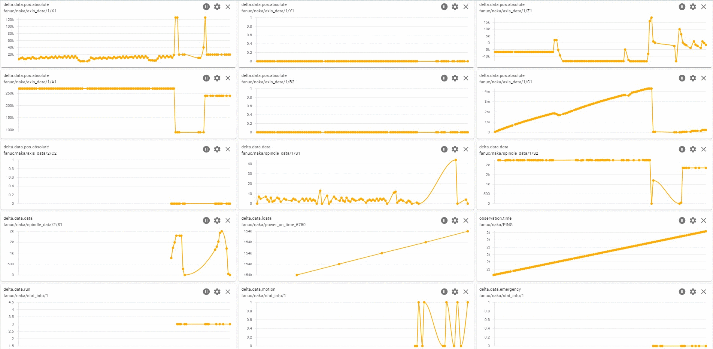
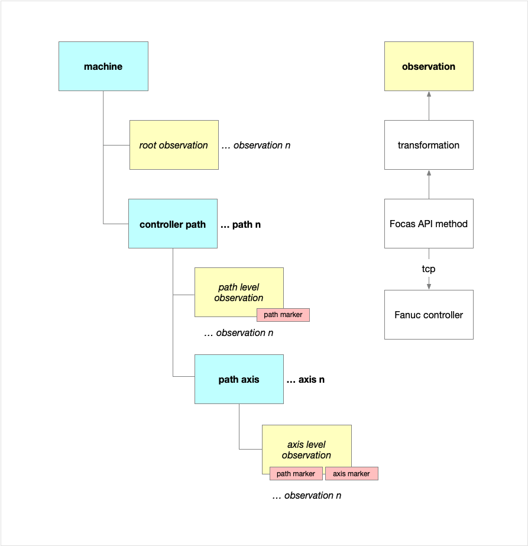
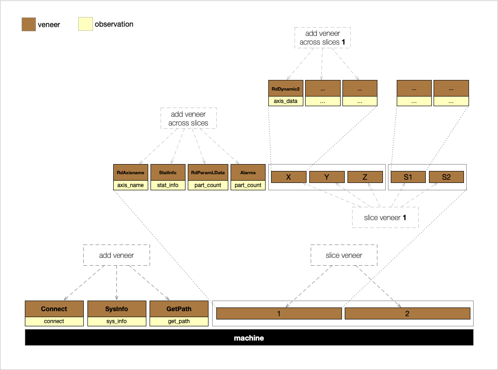
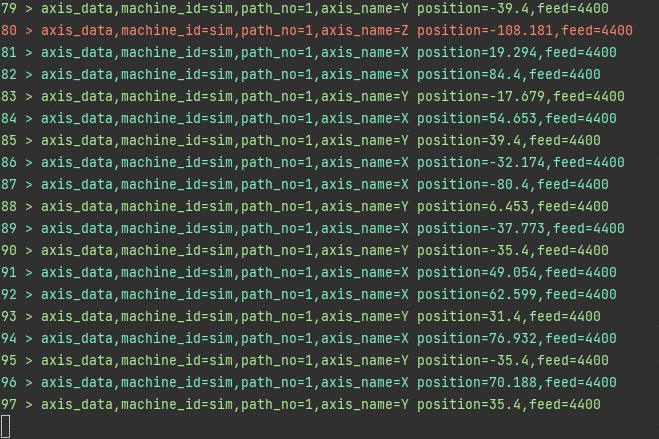
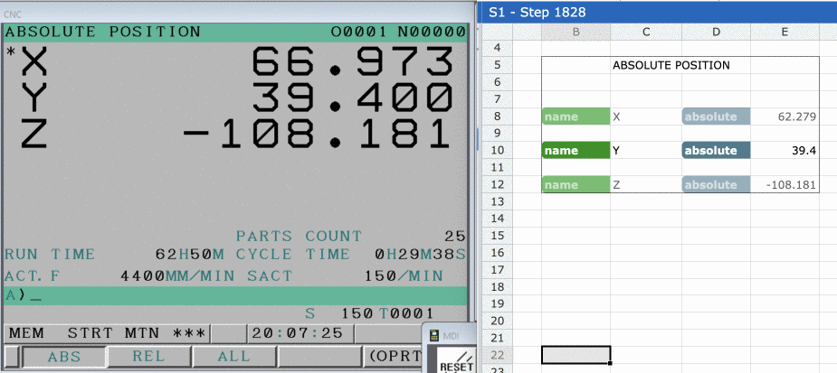

# fanuc-driver
  
This solution is built on top of Fanuc Focas libraries for interfacing with Fanuc controllers and publishing data to a MQTT broker or another target.

The primary goal of this solution is to maintain the machine data in its native source format with slight transformations to make it more human readable at the target.  The intention behind this approach is to allow the developer to reference original Focas API documentation further downstream to aid in their transformation and translation efforts.   

Below illustrates [Fanuc NC Guide](https://www.fanucamerica.com/products/cnc/software/cnc-guide-simulation-software) output visualized through [MQTT Explorer](http://mqtt-explorer.com/).


Below illustrates [Fanuc 0i-TF](https://www.fanucamerica.com/products/cnc/cnc-systems/series-0if) production output.



## MQTT Topic Structure - Suggested

### Machine Level Observations

```
fanuc/{machine-id}/{observation-name}
fanuc/{machine-id}-all/{observation-name}
```

### Execution Path Level Observations

```
fanuc/{machine-id}/{observation-name}/{controller-execution-path-number}
fanuc/{machine-id}-all/{observation-name}/{controller-execution-path-number}
```

### Axis or Spindle Level Observations

```
fanuc/{machine-id}/{observation-name}/{controller-execution-path-number}/{machine-axis-name / machine-spindle-name}
fanuc/{machine-id}-all/{observation-name}/{controller-execution-path-number}/{machine-axis-name / machine-spindle-name}

```

### Driver Status

```
fanuc/{machine-id}/PING
fanuc/{machine-id}-all/PING
```

### Machine Discovery

```
fanuc/DISCO
```

## MQTT Payload Structure - Suggested

Data deltas are published to MQTT broker as retained messages.  This means that any newly connected client will only receive the latest data for each observation.

Below is an example of native [`cnc_sysinfo`](https://www.inventcom.net/fanuc-focas-library/misc/cnc_sysinfo) invocation response data and the corresponding `sys_info` observation transformed data.

Native data:

```
{
  "addinfo": 1090,
  "max_axis": 32,
  "cnc_type": [
    " ",
    "0"
  ],
  "mt_type": [
    " ",
    "M"
  ],
  "series": [
    "D",
    "4",
    "F",
    "1"
  ],
  "version": [
    "3",
    "0",
    ".",
    "0"
  ],
  "axes": [
    "0",
    "3"
  ]
}
```

After transformation:

```
{
  "addinfo": 1090,
  "max_axis": 32,
  "cnc_type": " 0",
  "mt_type": " M",
  "series": "D4F1",
  "version": "30.0",
  "axes": "03"
}
```

Full published payload:

```
fanuc/sim/sys_info
fanuc/sim-all/sys_info
```

```
{
  "observation": {
    "time": 1620485344410,
    "machine": "sim",
    "name": "sys_info",
    "marker": {}
  },
  "source": {
    "method": "cnc_sysinfo",
    "invocationMs": 25,
    "data": {}
  },
  "delta": {
    "time": "00:00:01.4453544",
    "data": {
      "max_axis": 32,
      "cnc_type": " 0",
      "mt_type": " M",
      "series": "D4F1",
      "version": "30.0",
      "axes": "03"
    }
  }
}
```

## Concepts



A `Machine` instance includes:
* native connectivity information
* data output post-processor (`Handler`)
* data collection strategy (`Collector`)
* data collection transformation (`Veneer`)

### Handlers

A `Handler` is an observation post-processor and interface to target systems.

### Collectors

A `Collector` is a strategy to apply and peel veneers to reveal observations from native data in near real-time.

### Veneers

A `Veneer` is a thin transformation layer.  When peeled, each veneer reveals an observation.  Veneers can be applied/peeled as a whole.  Veneers can be sliced and applied/peeled across logical boundaries.  Atomic values should be used for slicing veneers.  Sliced veneers must be marked before peeling in order to understand their logical placement downstream.

### Veneering

The act of applying veneers in a logical manner.



### Peeling

The act of peeling veneers to reveal observations.


### Strategy Examples

#### Concept

During collector initialization, each call to `ApplyVeneer` binds a transformation class to an observation name.

```
public override void Initialize()
{
    _machine.ApplyVeneer(typeof(fanuc.veneers.Connect), "connect");
    _machine.ApplyVeneer(typeof(fanuc.veneers.SysInfo), "sys_info");
}
```

The collector is processed at set intervals.

```
public override void Collect()
{
    dynamic connect = _machine.Platform.Connect();
    _machine.PeelVeneer("connect", connect);
```

A connection is established to the Fanuc controller and the call to `PeelVeneer` reveals the *connect* observation.  The `Connect` `Veneer` instance is responsible for transforming the native Focas response where appropriate, comparing it to the last value seen, and invoking the `dataChanged` action.  The changed data is then available through the `Machine.Veneers.OnDataChange<Veneers, Veneer>` delegate.  Similarly, errors bubble up to `Machine.Veneers.OnError<Veneers, Veneer>`.


```
    if (connect.success)
    {
        dynamic info = _machine.Platform.SysInfo();
        _machine.PeelVeneer("sys_info", info);
```        

Next, the *sys_info* observation is revealed.  A call to Focas `cnc_sysinfo` is made via the `Machine.Platform.SysInfo` wrapper method.  The `SysInfo` `Veneer` instance then transforms native character arrays to strings, for easier readability.

```
        dynamic disconnect = _machine.Platform.Disconnect();
    }
        
    LastSuccess = connect.success;

}
```

Finally, the connection to the Fanuc controller is broken and the success of the `Collect` iteration captured.

#### Example: Basic01

Initialization of the `Basic01` `Collector` strategy binds several `Veneer` types to named observations.

```
_machine.ApplyVeneer(typeof(fanuc.veneers.Connect), "connect");
_machine.ApplyVeneer(typeof(fanuc.veneers.CNCId), "cnc_id");
_machine.ApplyVeneer(typeof(fanuc.veneers.RdTimer), "power_on_time");
_machine.ApplyVeneer(typeof(fanuc.veneers.RdParamLData), "power_on_time_6750");
_machine.ApplyVeneer(typeof(fanuc.veneers.SysInfo), "sys_info");
_machine.ApplyVeneer(typeof(fanuc.veneers.GetPath), "get_path");
```

Each data collection iteration retrieves data from the Fanuc controller and reveals individual observations.

```
dynamic connect = _machine.Platform.Connect();
_machine.PeelVeneer("connect", connect);

if (connect.success)
{
    dynamic cncid = _machine.Platform.CNCId();
    _machine.PeelVeneer("cnc_id", cncid);
    
    dynamic poweron = _machine.Platform.RdTimer(0);
    _machine.PeelVeneer("power_on_time", poweron);
    
    dynamic poweron_6750 = _machine.Platform.RdParam(6750, 0, 8, 1);
    _machine.PeelVeneer("power_on_time_6750", poweron_6750);
    
    dynamic info = _machine.Platform.SysInfo();
    _machine.PeelVeneer("sys_info", info);
    
    dynamic paths = _machine.Platform.GetPath();
    _machine.PeelVeneer("get_path", paths);

    dynamic disconnect = _machine.Platform.Disconnect();
}

LastSuccess = connect.success;
```

#### Example: [Basic02](fanuc/collectors/Basic02.cs)

#### Example: [Basic03](fanuc/collectors/Basic03.cs)

#### Example: [Basic04](fanuc/collectors/Basic04.cs)

#### Example: [Basic05](fanuc/collectors/Basic05.cs)

#### Example: [Basic06](fanuc/collectors/Basic06.cs)

### Post-Processing Examples

#### Splunk Metric

`handler_type: fanuc.handlers.SplunkMetric, fanuc`


#### Influx Line

handler_type: fanuc.handlers.InfluxLine, fanuc



## Configuration

The `config.yml` file contains runtime information about each Focas endpoint and it target MQTT broker.

```
machines:
  - id: sim
    enabled: !!bool true
    net_ip: 10.20.30.101
    net_port: !!int 8193
    net_timeout_s: !!int 2
    strategy_type: fanuc.collectors.Basic06, fanuc
    sweep_ms: !!int 1000
    handler_type: fanuc.handlers.Native, fanuc
    broker:
      enabled: !!bool true
      net_ip: 172.16.10.3
      net_port: !!int 1883
      publish_status: !!bool true
      publish_arrivals: !!bool true
      publish_changes: !!bool true

  - id: naka
    enabled: !!bool false
    net_ip: 172.16.13.100
    net_port: !!int 8193
    net_timeout_s: !!int 5
    strategy_type: fanuc.collectors.Basic06, fanuc
    sweep_ms: !!int 1000
    handler_type: fanuc.handlers.Native, fanuc
    broker:
      enabled: !!bool true
      net_ip: 172.16.10.3
      net_port: !!int 1883
      publish_status: !!bool true
      publish_arrivals: !!bool true
      publish_changes: !!bool true
```

## Building and Running

### armv7

Follow .NET Core SDK installation instructions here: https://sukesh.me/2020/07/07/how-to-install-net-core-on-raspberry-pi/  
  
Clone the repository, build the project, and run it.  
  
```  
export DOTNET_ROOT=$HOME/dotnet
export PATH=$PATH:$HOME/dotnet

cd ~

git clone https://github.com/Ladder99/fanuc-driver.git  

cd fanuc-driver/fanuc  

dotnet build  /nowarn:CS0618 /nowarn:CS8632 -p:DefineConstants=ARMV7  

./bin/Debug/netcoreapp3.1/fanuc  
```
  
### win32
  
Install JetBrains Rider and build for 32-bit CPU.  
  
### linux64

#### DOES NOT WORK: assuming interop field sizes do not match architecture.

Follow .NET Core SDK installation instructions here: https://docs.microsoft.com/en-us/dotnet/core/install/linux-ubuntu  
  
Clone the repository, build the project, and run it.  
  
```  
cd ~

git clone https://github.com/Ladder99/fanuc-driver.git  

cd fanuc-driver/fanuc  

dotnet build  /nowarn:CS0618 /nowarn:CS8632 -p:DefineConstants=LINUX64 

./bin/Debug/netcoreapp3.1/fanuc  
```
  
### linux32
  
Not tested.  

## Docker

Install Docker and docker-compose.

```
sudo apt-get update
sudo apt-install curl
curl -sSL https://get.docker.com | sh
sudo usermod -aG docker $(whoami)
newgrp docker
sudo systemctl enable docker
sudo systemctl start docker
sudo apt install python3-pip
sudo apt-get -y install libffi-dev libssl-dev python3-dev python3 python3-pip
sudo pip3 install docker-compose
sync
```

### Architecture: armv7 and aarch64

Config file used: `~/fanuc-driver/docker/config.yml`

Build container:

```
cd ~

git clone https://github.com/Ladder99/fanuc-driver.git  

cd fanuc-driver  

docker build -f Dockerfile.ARM --tag=ladder99/fanuc-driver:latest .

# docker push ladder99/fanuc-driver
```

### Run Container:

```
docker run -it ladder99/fanuc-driver:latest
```

### Run Containers using Docker Compose:

Run fanuc-driver, [Mosquitto](https://docs.cedalo.com/latest/docs/mosquitto/broker-overview) MQTT broker, and [Streamsheets](https://docs.cedalo.com/latest/docs/streamsheets/sheets):

Config file used: `~/fanuc-volumes/fanuc-driver/config.yml`

```
cd ~

git clone https://github.com/Ladder99/fanuc-driver.git 

mkdir -p fanuc-volumes/fanuc-driver
cp fanuc-driver/docker/config.yml fanuc-volumes/fanuc-driver/config.yml

mkdir -p fanuc-volumes/mosquitto/config
mkdir -p fanuc-volumes/mosquitto/data
mkdir -p fanuc-volumes/mosquitto/log
cp fanuc-driver/docker/mosquitto.conf fanuc-volumes/mosquitto/config/mosquitto.conf

cd fanuc-driver/docker

docker-compose up -d
```

Naviagate to [http://raspberrypi.local:8081](http://raspberrypi.local:8081) for the Streamsheets interface.  After getting to know Streamsheets, you will be able to create all kinds of Fanuc spreadsheets!



// FIX: Mongo unclean shutdown on reboot.