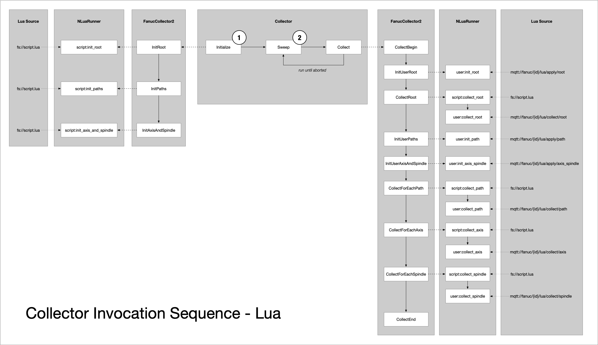
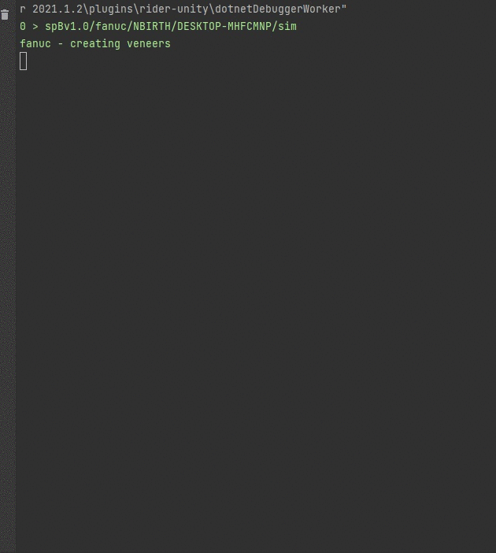

# fanuc-driver

***
## :fire: NEW COOL STUFF! :fire:

### Configure data collection on the fly using MQTT and Lua! 

1. ***Static Lua Scripts.*** You can now collect data with Lua scripts.  This means no more compiling C# code when you want to modify your data collection strategy.

2. ***Live Lua Scripts.*** Modify the running data collection strategy by publishing a Lua payload over MQTT.  This means you can tinker live and find the parameters, diagnostics, and other data points that work best for you.
***

## Contents

1. [Cybersecurity](#cybersecurity)
2. [Overview](#overview)
3. [Suggested MQTT Topic Structure](#suggested-mqtt-topic-structure)
4. [Suggested MQTT Payload Structure](#suggested-mqtt-payload-structure)
5. [Concepts and Examples](#concepts)
6. [Building and Running](#building-and-running)
7. [Docker Deployment](#docker) 
8. [Focas Library Matrix](FOCAS_LIBRARY_MATRIX.md)
9. [Focas Function Matrix](FOCAS_FUNCTION_MATRIX.md)
10. [Focas Function Platform Matrix](FOCAS_FUNCTION_PLATFORM_MATRIX.md)
11. [API Description and Sample Responses](PLATFORM.md)

## Cybersecurity

Review [Fanuc Vulnerability Information](https://www.fanuc.co.jp/en/product/vulnerability/index.html) before proceeding.

## Overview

This solution is built on top of Fanuc Focas libraries for interfacing with Fanuc controllers and publishing data to a MQTT broker or another target.

The primary goal of this solution is to maintain the machine data in its native source format with slight transformations to make it more human readable at the target.  The intention behind this approach is to allow the developer to reference original [Focas API documentation](docs/FOCAS2_Linux.pdf) further downstream to aid in their transformation and translation efforts.  Concepts in the [`base-driver`](https://github.com/Ladder99/base-driver) repository can be reused to create structured drivers for other protocols.  

Below illustrates [Fanuc NC Guide](https://www.fanucamerica.com/products/cnc/software/cnc-guide-simulation-software) output visualized with [MQTT Explorer](http://mqtt-explorer.com/).


Below illustrates [Fanuc 0i-TF](https://www.fanucamerica.com/products/cnc/cnc-systems/series-0if) production output.


## Suggested MQTT Topic Structure

Observations can be single data points, such as axis absolute position or motor temperature.  Observations can also be more compound such as the health of a spindle which would package multiple relevant data points into a single observation payload.  Results of calls into the Focas library highly depend on the context they are invoked in.  For example, retrieving the position of an axis on the second execution path of the controller, requires that the second path is made active and the appropriate axis is called out when making the call.  This hierarchy is captured in the suggested topic structure below.

### Machine Level Observations

```
fanuc/{machine-id}/{observation-name}
fanuc/{machine-id}-all/{observation-name}
```

### Execution Path Level Observations

```
fanuc/{machine-id}/{observation-name}/{controller-execution-path-number}
fanuc/{machine-id}-all/{observation-name}/{controller-execution-path-number}
```

### Axis or Spindle Level Observations

```
fanuc/{machine-id}/{observation-name}/{controller-execution-path-number}/{machine-axis-name / machine-spindle-name}
fanuc/{machine-id}-all/{observation-name}/{controller-execution-path-number}/{machine-axis-name / machine-spindle-name}

```

### Driver Status

```
fanuc/{machine-id}/PING
fanuc/{machine-id}-all/PING
```

### Machine Discovery

```
fanuc/DISCO
```

## Suggested MQTT Payload Structure

Data deltas are published to MQTT broker as retained messages.  This means that any newly connected client will only receive the latest data for each observation.

Below is an example of native [`cnc_sysinfo`](https://www.inventcom.net/fanuc-focas-library/misc/cnc_sysinfo) invocation response data and the corresponding `sys_info` observation transformed data.

Native data from controller:

```json
{
  "addinfo": 1090,
  "max_axis": 32,
  "cnc_type": [
    " ",
    "0"
  ],
  "mt_type": [
    " ",
    "M"
  ],
  "series": [
    "D",
    "4",
    "F",
    "1"
  ],
  "version": [
    "3",
    "0",
    ".",
    "0"
  ],
  "axes": [
    "0",
    "3"
  ]
}
```

Data after transformation:

```json
{
  "addinfo": 1090,
  "max_axis": 32,
  "cnc_type": " 0",
  "mt_type": " M",
  "series": "D4F1",
  "version": "30.0",
  "axes": "03"
}
```

Data as published to the broker:

```
fanuc/sim/sys_info
fanuc/sim-all/sys_info
```

```json
{
  "observation": {
    "time": 1620485344410,
    "machine": "sim",
    "name": "sys_info",
    "marker": {}
  },
  "source": {
    "method": "cnc_sysinfo",
    "invocationMs": 25,
    "data": {}
  },
  "delta": {
    "time": "00:00:01.4453544",
    "data": {
      "max_axis": 32,
      "cnc_type": " 0",
      "mt_type": " M",
      "series": "D4F1",
      "version": "30.0",
      "axes": "03"
    }
  }
}
```

## Concepts


A `Machine` instance includes:
* native connectivity information
* data output post-processor (`Handler`)
* data collection strategy (`Collector`)
* data collection transformation (`Veneer`)

### Handlers

A `Handler` is an observation post-processor and interface to target systems.

### Collectors

A `Collector` is a strategy to apply and peel veneers to reveal observations from native data in near real-time.

### Veneers

A `Veneer` is a thin transformation layer.  When peeled, each veneer reveals an observation.  Veneers can be applied/peeled as a whole.  Veneers can be sliced and applied/peeled across logical boundaries (e.g. path, axis, spindle).  Atomic values should be used for slicing veneers.  Sliced veneers must be marked before peeling in order to convey the logical hierarchy of the observation to downstream systems.

Example of an observation marker for spindle 'S' on execution path '1'.

```json
"marker": [
      {
        "path_no": 1
      },
      {
        "name": "S",
        "suff1": "",
        "suff2": ""
      }
    ]
```

### Veneering

The act of applying veneers in a logical manner in order to bind transformation logic to an observation.


### Peeling

The act of peeling veneers in order to execute transformations and reveal observations.


### Strategy Examples

#### Concept

During collector initialization, each call to `ApplyVeneer` binds a transformation class to an observation name.

```c#
public override async Task<dynamic?> InitializeAsync()
{
    _machine.ApplyVeneer(typeof(fanuc.veneers.Connect), "connect");
    _machine.ApplyVeneer(typeof(fanuc.veneers.SysInfo), "sys_info");
}
```

The collector is processed at set intervals.

```c#
public override async Task<dynamic?> CollectAsync()
{
    dynamic connect = await machine["platform"].ConnectAsync();
    await machine.PeelVeneerAsync("connect", connect);
```

A connection is established to the Fanuc controller and the call to `PeelVeneer` reveals the *connect* observation.  The [`Connect`](fanuc/veneers/Connect.cs) `Veneer` instance is responsible for transforming the native Focas response where appropriate, comparing it to the last value seen, and invoking the `onDataArrived` and `onDataChanged` actions.  Every arrived data is available via the `Machine.Veneers.OnDataArrival<Veneers, Veneer>` delegate. Changed data is available via the `Machine.Veneers.OnDataChange<Veneers, Veneer>` delegate.  Similarly, errors bubble up to `Machine.Veneers.OnError<Veneers, Veneer>`.

```c#
    if (connect.success)
    {
        dynamic info = _machine.Platform.SysInfoAsync();
        await _machine.PeelVeneerAsync("sys_info", info);
```        

Next, the *sys_info* observation is revealed.  A call to Focas `cnc_sysinfo` is made via the `Machine.Platform.SysInfo` wrapper method.  The [`SysInfo`](fanuc/veneers/SysInfo.cs) `Veneer` instance then transforms native character arrays to strings, for easier readability.

```
        dynamic disconnect = _machine.Platform.Disconnect();
    }
        
    LastSuccess = connect.success;

}
```

Finally, the connection to the Fanuc controller is broken and the success of the `Collect` iteration captured.

#### Example: [Basic01](fanuc/collectors/Basic01.cs)

Initialization of the `Basic01` `Collector` strategy binds several `Veneer` types to named observations.

```c#
machine.ApplyVeneer(typeof(fanuc.veneers.Connect), "connect");
machine.ApplyVeneer(typeof(fanuc.veneers.CNCId), "cnc_id");
machine.ApplyVeneer(typeof(fanuc.veneers.RdTimer), "power_on_time");
machine.ApplyVeneer(typeof(fanuc.veneers.RdParamLData), "power_on_time_6750");
machine.ApplyVeneer(typeof(fanuc.veneers.SysInfo), "sys_info");
machine.ApplyVeneer(typeof(fanuc.veneers.GetPath), "get_path");
```

Each data collection iteration retrieves data from the Fanuc controller and reveals individual observations.

```c#
if (connect.success)
{
    dynamic cncid = await machine["platform"].CNCIdAsync();
    await machine.PeelVeneerAsync("cnc_id", cncid);

    dynamic poweron = await machine["platform"].RdTimerAsync(0);
    await machine.PeelVeneerAsync("power_on_time", poweron);

    dynamic poweron_6750 = await machine["platform"].RdParamDoubleWordNoAxisAsync(6750);
    await machine.PeelVeneerAsync("power_on_time_6750", poweron_6750);

    dynamic info = await machine["platform"].SysInfoAsync();
    await machine.PeelVeneerAsync("sys_info", info);

    dynamic paths = await machine["platform"].GetPathAsync();
    await machine.PeelVeneerAsync("get_path", paths);

    dynamic disconnect = await machine["platform"].DisconnectAsync();
}

LastSuccess = connect.success;
```

#### Example: [Basic02](fanuc/collectors/Basic02.cs)

#### Example: [Basic03](fanuc/collectors/Basic03.cs)

#### Example: [Basic04](fanuc/collectors/Basic04.cs)

#### Example: [Basic05](fanuc/collectors/Basic05.cs)

#### Example: [Basic06](fanuc/collectors/Basic06.cs)

#### Example: [Basic07](fanuc/collectors/Basic07.cs)

#### Example: [Basic08](fanuc/collectors/Basic08.cs)

This example departs from previous ones based on the emerged pattern of data collection at different levels in the Fanuc component hierarchy as it relates to the Focas windowing function calls.  Data collection is broken down by path, axis, and spindle with the boiler plate implemented in [`FanucCollector2`](fanuc/collectors/FanucCollector2.cs) base class.

```c#
using System.Threading.Tasks;
using l99.driver.@base;

namespace l99.driver.fanuc.collectors
{
    public class Basic08 : FanucCollector2
    {
        public Basic08(Machine machine, int sweepMs = 1000) : base(machine, sweepMs)
        {
            
        }
        
        // global machine observations
        public override async Task InitRootAsync()
        {
            apply(typeof(fanuc.veneers.CNCId), "cnc_id");
            
            apply(typeof(fanuc.veneers.RdParamLData), "power_on_time");
        }
        
        // execution path observations
        public override async Task InitPathsAsync()
        {
            apply(typeof(fanuc.veneers.SysInfo), "sys_info");
            
            apply(typeof(fanuc.veneers.StatInfo), "stat_info");

            apply(typeof(fanuc.veneers.Figures), "figures");
            
            apply(typeof(fanuc.veneers.GCodeBlocks), "gcode_blocks");
        }
        
        // axis and spindle observations
        public override async Task InitAxisAndSpindleAsync()
        {
            apply(typeof(fanuc.veneers.RdDynamic2_1), "axis_data");
            
            apply(typeof(fanuc.veneers.RdActs2), "spindle_data");
        }
        
        // 
        //    collection sweep
        //
        //    begin => 
        //        root/global =>
        //        walk each execution path =>
        //        walk each axis in execution path =>
        //        walk each spindle in execution path =>
        //    end => 
        //    sleep => 
        //    begin ...
        //    
        
        public override async Task<bool> CollectBeginAsync()
        {
            return await base.CollectBeginAsync();
        }
        
        // reveal global machine observations
        public override async Task CollectRootAsync()
        {
            // single data point observation
            //
            //    set_native_and_peel
            //        1. cache focas returned value as "cnc_id"
            //        2. reveal observation bound by "cnc_id" in InitRootAsync function
            //
            await set_native_and_peel("cnc_id", await _platform.CNCIdAsync());
                    
            await set_native_and_peel("power_on_time", await _platform.RdParamDoubleWordNoAxisAsync(6750));
        }

        // reveal execution path observations
        public override async Task CollectForEachPathAsync(short current_path, dynamic path_marker)
        {
            await set_native_and_peel("sys_info", await _platform.SysInfoAsync());
                        
            await set_native_and_peel("stat_info", await _platform.StatInfoAsync());
            
            await set_native_and_peel("figures", await _platform.GetFigureAsync(0, 32));
            
            // compound observation
            //
            //    set_native
            //        1. cache focas returned value as "blkcount", "actpt", "execprog"
            //  
            //    peel
            //        1. reveal observation bound by "gcode_blocks" in InitPathAsync function
            //              "blkcount", "actpt", and "execprog" data is fed into the transformation logic
            //
            await peel("gcode_blocks",
                await set_native("blkcount", await _platform.RdBlkCountAsync()),
                await set_native("actpt", await _platform.RdActPtAsync()),
                await set_native("execprog", await _platform.RdExecProgAsync(128)));
        }

        // reveal axis observations
        public override async Task CollectForEachAxisAsync(short current_axis, dynamic axis_split, dynamic axis_marker)
        {
            // 
            //  get
            //      retrieve "figures" value from cache previously set in CollectForEachPathAsync
            //
            await peel("axis_data",
                await set_native("axis_dynamic", await _platform.RdDynamic2Async(current_axis, 44, 2)), 
                get("figures"), 
                current_axis - 1);
        }

        // reveal spindle observations
        public override async Task CollectForEachSpindleAsync(short current_spindle, dynamic spindle_split, dynamic spindle_marker)
        {
            await set_native_and_peel("spindle_data", await _platform.Acts2Async(current_spindle));
        }

        public override async Task CollectEndAsync()
        {
            await base.CollectEndAsync();
        }
    }
}
```

#### Example: [NLuaRunner](fanuc/collectors/NLuaRunner.cs)

More docs to come, until then please review the Lua scripts. [ex1](fanuc/lua/collector_example1.lua) [ex4](fanuc/lua/collector_example4.lua)



### Post-Processing Examples

#### Splunk Metric

`handler_type: l99.driver.fanuc.handlers.SplunkMetric, fanuc`


#### Influx Line

`handler_type: l99.driver.fanuc.handlers.InfluxLine, fanuc`


#### Sparkplug-B

`handler_type: l99.driver.fanuc.handlers.SparkplugB, fanuc`



## Configuration

The `config.yml` file contains runtime information about each Focas endpoint and it target MQTT broker.

```yaml
machines:
  - id: sim
    enabled: !!bool true
    type: l99.driver.fanuc.FanucMachine, fanuc
    strategy_type: l99.driver.fanuc.collectors.Basic06, fanuc
    handler_type: l99.driver.fanuc.handlers.Native, fanuc
    sweep_ms: !!int 1000
    net_ip: 10.20.30.101
    net_port: !!int 8193
    net_timeout_s: !!int 2
    broker:
      enabled: !!bool false
      net_ip: 10.20.30.102
      net_port: !!int 1883
      auto_connect: !!bool true
      publish_status: !!bool true
      publish_arrivals: !!bool true
      publish_changes: !!bool true
      publish_disco: !!bool true
      disco_base_topic: fanuc

  - id: naka
    enabled: !!bool false
    type: l99.driver.fanuc.FanucMachine, fanuc
    strategy_type: l99.driver.fanuc.collectors.Basic06, fanuc
    handler_type: l99.driver.fanuc.handlers.Native, fanuc
    sweep_ms: !!int 1000
    net_ip: 172.16.13.100
    net_port: !!int 8193
    net_timeout_s: !!int 5
    broker:
      enabled: !!bool false
      net_ip: 172.16.10.3
      net_port: !!int 1883
      auto_connect: !!bool true
      publish_status: !!bool true
      publish_arrivals: !!bool true
      publish_changes: !!bool true
      publish_disco: !!bool true
      disco_base_topic: fanuc
```

## Building and Running

### armv7

(for aarch64, see Docker)

Follow .NET Core SDK installation instructions here: https://sukesh.me/2020/07/07/how-to-install-net-core-on-raspberry-pi/  
  
Clone the repository, build the project, and run it.  
  
```
export DOTNET_ROOT=$HOME/dotnet
export PATH=$PATH:$HOME/dotnet

cd ~

git clone --recurse-submodules -j8 https://github.com/Ladder99/fanuc-driver.git  

cd fanuc-driver/fanuc  

dotnet build  /nowarn:CS0618 /nowarn:CS8632 /nowarn:CS1998 -p:DefineConstants=ARMV7  

./bin/Debug/netcoreapp3.1/fanuc  
```

### linux x64 (TODO)

Follow .NET Core SDK installation instructions here: TODO

Clone the repository, build the project, and run it.

```  
export DOTNET_ROOT=$HOME/dotnet
export PATH=$PATH:$HOME/dotnet

cd ~

git clone --recurse-submodules -j8 https://github.com/Ladder99/fanuc-driver.git  

cd fanuc-driver/fanuc  

dotnet build  /nowarn:CS0618 /nowarn:CS8632 /nowarn:CS1998 -p:DefineConstants=LINUX64  

./bin/Debug/netcoreapp3.1/fanuc  
```

### windows x32
  
Install [JetBrains Rider](https://www.jetbrains.com/rider/) and build for 32-bit CPU.  

### windows x64 (TODO)

## Docker

Install Docker and docker-compose.

```
sudo apt-get update
sudo apt-install curl
curl -sSL https://get.docker.com | sh
sudo usermod -aG docker $(whoami)
newgrp docker
sudo systemctl enable docker
sudo systemctl start docker
sudo apt install python3-pip
sudo apt-get -y install libffi-dev libssl-dev python3-dev python3 python3-pip
sudo pip3 install docker-compose
sync
```

### Architecture: armv7 and aarch64

NLog file used: `~/fanuc-driver/docker/nlog.config`  
Config file used: `~/fanuc-driver/docker/config.yml`

Build container:

```
cd ~

git clone --recurse-submodules -j8 https://github.com/Ladder99/fanuc-driver.git  

cd fanuc-driver  

docker build -f Dockerfile.ARM --tag=ladder99/fanuc-driver:latest .
```

### Architecture: linux amd64

NLog file used: `~/fanuc-driver/docker/nlog.config`  
Config file used: `~/fanuc-driver/docker/config.yml`

Build container:

```
cd ~

git clone --recurse-submodules -j8 https://github.com/Ladder99/fanuc-driver.git  

cd fanuc-driver  

docker build -f Dockerfile.LINUX64 --tag=ladder99/fanuc-driver:latest .
```

### Run Container:

```
docker run -it ladder99/fanuc-driver:latest
```

### Run Containers using Docker Compose:

Run fanuc-driver, [Mosquitto](https://docs.cedalo.com/latest/docs/mosquitto/broker-overview) MQTT broker, and [Streamsheets](https://docs.cedalo.com/latest/docs/streamsheets/sheets):

NLog file used: `~/fanuc-volumes/fanuc-driver/nlog.config`  
Config file used: `~/fanuc-volumes/fanuc-driver/config.yml`

```
cd ~

git clone --recurse-submodules -j8 https://github.com/Ladder99/fanuc-driver.git 

mkdir -p fanuc-volumes/fanuc-driver
cp fanuc-driver/docker/nlog.config fanuc-volumes/fanuc-driver/nlog.config
cp fanuc-driver/docker/config.yml fanuc-volumes/fanuc-driver/config.yml

mkdir -p fanuc-volumes/mosquitto/config
mkdir -p fanuc-volumes/mosquitto/data
mkdir -p fanuc-volumes/mosquitto/log
cp fanuc-driver/docker/mosquitto.conf fanuc-volumes/mosquitto/config/mosquitto.conf

cd fanuc-driver/docker

docker-compose up -d
```

Naviagate to [http://raspberrypi.local:8081](http://raspberrypi.local:8081) for the Streamsheets interface.  After getting to know Streamsheets, you will be able to create all kinds of Fanuc spreadsheets!


// FIX: Mongo unclean shutdown on reboot.