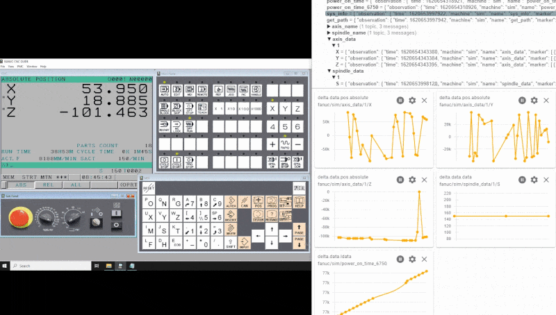
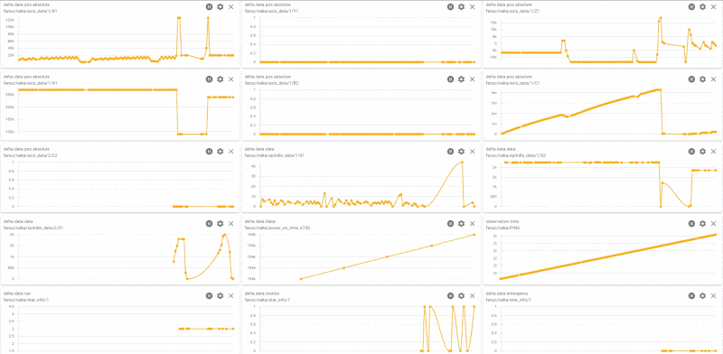

# Fanuc Driver

> WARNING:
> Review [Fanuc Vulnerability Information](https://www.fanuc.co.jp/en/product/vulnerability/index.html) before proceeding.

## Overview

Built on top of Fanuc Focas native libraries, [`Fanuc Driver`](https://github.com/Ladder99/fanuc-driver) transforms controller data to various protocols and formats.  Supported outputs include MQTT JSON, MQTT SparkplugB, InfluxDb Line Protocol, and MTConnect SHDR. Concepts in the [`base-driver`](https://github.com/Ladder99/base-driver) repository can be reused to create transofrmation logic to other transports and formats.

Below illustrates [Fanuc NC Guide](https://www.fanucamerica.com/products/cnc/software/cnc-guide-simulation-software) output visualized with [MQTT Explorer](http://mqtt-explorer.com/).

Below illustrates [Fanuc 0i-TF](https://www.fanucamerica.com/products/cnc/cnc-systems/series-0if) production output.

## Videos

- [Setup - v0.1](https://www.youtube.com/watch?v=_sZ0qCVkTkM)
- [Setup / Changes - v0.2](https://www.youtube.com/watch?v=yhe_apuiJVY)
- [InfluxDb Output](https://www.youtube.com/watch?v=gqfBj0ImMrw)
- [MTConnect Output](https://www.youtube.com/watch?v=j1gXHXA2RW0)
- [SparkplugB Output](https://www.youtube.com/watch?v=yw0TMXsLHro)

## Focas Library Matrix

Below table outlines controller, operating system and architecture compatibility for the included native Focas libraries.

| Name | OS | Width | Description |
|---|---|---|---|
| FWLIB32.DLL | Windows | 32 | CNC/PMC Data window control library |
| FWLIBE1.DLL | Windows | 32 | Processing library for TCP/IP |
| FWLIB30i.DLL | Windows | 32 | Processing library for 30i/31i/32i/35i, PMi-A |
| FWLIB150.DLL | Windows | 32 | Processing library for 150-B |
| FWLIB15i.DLL | Windows | 32 | Processing library for 150i |
| FWLIB160.DLL | Windows | 32 | Processing library for 160/180/210 |
| FWLIB16W.DLL | Windows | 32 | Processing library for 160i/180i-W |
| FWLIB0i.DLL  | Windows | 32 | Processing library for 0i-A |
| FWLIB0iB.DLL | Windows | 32 | Processing library for 0i-B |
| FWLIB0iD.DLL | Windows | 32 | Processing library for 0i-D |
| FWLIBPM.DLL  | Windows | 32 | Processing library for Power Mate-D/H |
| FWLIBPMi.DLL | Windows | 32 | Processing library for Power Mate i-D/H |
| FWLIBNCG.DLL | Windows | 32 | Processing library for FS31i/32i/35i NCGuidePro |
| FWLIB0DN.DLL | Windows | 32 | Processing library for FS0i-D NCGuidePro |
| libfwlib32-linux-x86.so.1.0.0 | Linux | 32 | Processing library for Linux |
| libfwlib32-linux-x86.so.1.0.5 | Linux | 32 | Processing library for Linux |
| libfwlib32-linux-armv7.so.1.0.5 | Linux | 32 | Processing library for Linux |
| libfwlib32-linux-x64.so.1.0.5 | Linux | 64 | Processing library for Linux |
| FWLIB64.DLL    | Windows | 64 | CNC/PMC Data window control library |
| FWLIBE64.DLL   | Windows | 64 | Processing library for TCP/IP |
| FWLIB30i64.DLL | Windows | 64 | Processing library for 30i/31i/32i/35i, PMi-A |
| FWLIB0iD64.DLL | Windows | 64 | Processing library for 0i-D |
| FWLIBNCG64.DLL | Windows | 64 | Processing library for FS31i/32i/35i NCGuidePro |
| FWLIB0DN64.DLL | Windows | 64 | Processing library for FS0i-D NCGuidePro |

